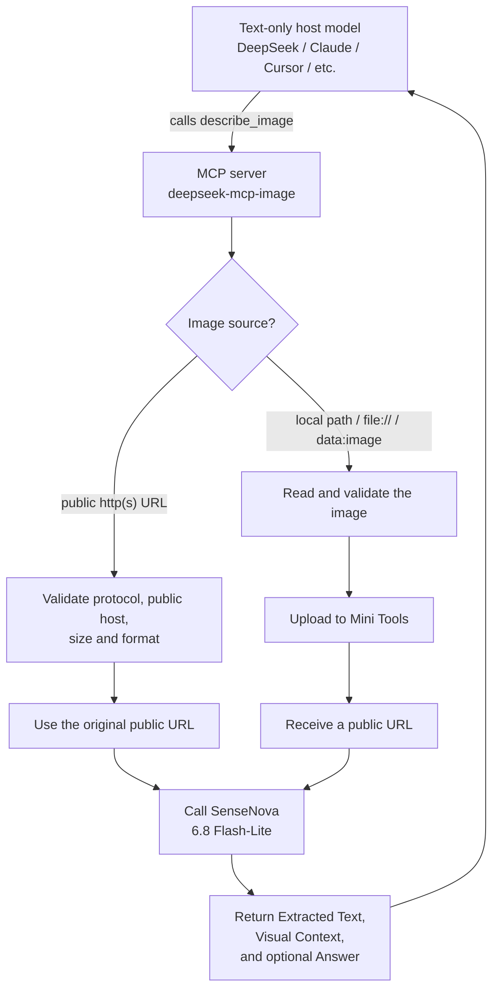

# deepseek-mcp-image

[中文](README.md) | English

## Acknowledgements

Public hosting for local images uses the [Mini Tools Image API](https://mini-tools.uk/image-api).
Thanks to [knsjd25](https://github.com/knsjd25) for [mini-tools.uk](https://github.com/knsjd25/mini-tools.uk).

A vision MCP server **built for DeepSeek and other text-only LLMs** — giving models without image input the ability to see.

The host model calls the `describe_image` tool with a **local file path** or an **http(s) URL**. Public URLs are validated and sent to SenseNova as-is; local files are first uploaded to the [Mini Tools Image API](https://mini-tools.uk/image-api), then the returned public URL is sent to **SenseNova 6.8 Flash-Lite** (`sensenova-6.8-flash-lite`) for recognition.

## How it works

SenseNova only accepts a publicly reachable image URL. The MCP server therefore branches on the source: public URLs are forwarded after validation; local images are uploaded to the image host first, then the public link is sent to SenseNova.



## Requirements

- Node.js ≥ 18
- SenseNova API Key (see [Get a SenseNova API key](#get-a-sensenova-api-key) below)
- For **local images**, a Mini Tools image-host user ID and API key (see [Apply for an image-host account and API key](#apply-for-an-image-host-account-and-api-key))

## Install

```bash
git clone https://github.com/Chuyuxuan0v0/deepseek-mcp-image.git
cd deepseek-mcp-image
npm install
```

## Get a SenseNova API key

Vision calls go through the [SenseNova platform](https://platform.sensenova.cn/). Official steps: [Register and get an API key](https://github.com/OpenSenseNova/SenseNova6.7/blob/main/API_CN.md#1-注册账号与获取-api-key).

1. Open the [console](https://platform.sensenova.cn/console) or [login page](https://platform.sensenova.cn/login). Register (typically a +86 phone number and SMS code) and complete identity verification. Free token quota is described on the [Token Plan](https://platform.sensenova.cn/token-plan) page.
2. In the console sidebar: **Admin Center → API-Key management → Create API-Key**.
3. **Copy the full key immediately** (usually starts with `sk-`). It is shown only once at creation. If it leaks, disable or delete it on the same page and create a new one.
4. This project uses `https://token.sensenova.cn/v1` and model `sensenova-6.8-flash-lite`. Put the key in local `.env` as `SENSENOVA_API_KEY`. Do not commit it.

## Apply for an image-host account and API key

Local files must become a public URL. This project uses the [Mini Tools Image API](https://mini-tools.uk/image-api). Anyone can upload on the website, but the MCP talks to the server API, which needs an administrator-issued account.

1. Open the [Image Upload API docs](https://mini-tools.uk/image-api) and apply as described there. The process is the same as long-term storage: **email the administrator**.
2. Use [admin@mini-tools.uk](mailto:admin@mini-tools.uk) (also listed on the [GitHub repo](https://github.com/knsjd25/mini-tools.uk) and the [contact page](https://mini-tools.uk/contact)). A short purpose is enough, e.g. “open-source MCP vision proxy: upload local images to a public URL”.
3. Credentials are enabled only after the administrator verifies your email. You will receive:
   - **User ID** (`X-API-User-ID`)
   - **API Key** (`Authorization: Bearer …`, usually starting with `mtu_live_`)
4. You need both. Put them only in a local `.env`. Do not hardcode them, commit them, or email the key back.

Then copy `.env.example` to `.env`:

```env
SENSENOVA_API_KEY=sk-your-sensenova-key
X-API-User-ID=assigned-user-id
Authorization=Bearer mtu_live_your_key
```

`MINI_TOOLS_USER_ID` / `MINI_TOOLS_API_KEY` are also accepted.

## Environment Variables

| Variable | Required | Default | Description |
|---|---|---|---|
| `SENSENOVA_API_KEY` | ✅ | — | SenseNova API Key |
| `SENSENOVA_BASE_URL` | — | `https://token.sensenova.cn/v1` | API base URL |
| `MINI_TOOLS_USER_ID` | ✅ for local paths | — | Mini Tools image-host user ID (or `X-API-User-ID`) |
| `MINI_TOOLS_API_KEY` | ✅ for local paths | — | Mini Tools image-host API key (or `Authorization=Bearer …`) |
| `MINI_TOOLS_DURATION` | — | `1-day` | Retention: `1-day` / `7-day` / `30-day` / `permanent` |
| `MAX_IMAGE_BYTES` | — | `20971520` (20MB) | Max size for remote URLs; uploads to the image host are capped at 5MB |

You can copy `.env.example` to `.env` in the repo root (gitignored). The server loads it on startup; MCP client `env` values take precedence.

Image-host credentials are **for personal use only**. Do not hardcode them, commit them, or share them.

PowerShell (Windows) example:

```powershell
$env:SENSENOVA_API_KEY = "sk-your-key"
$env:MINI_TOOLS_USER_ID = "your-image-host-user-id"
$env:MINI_TOOLS_API_KEY = "your-image-host-api-key"
```

## Run Tests

```bash
npm test
```

## View how many images are on your account

The image-host API does not allow a local HTML file to call it from the browser (CORS). This repo includes a local gallery: `gallery-server.mjs` reads `.env` and fetches [usage](https://mini-tools.uk/image-api) plus the list of still-valid images.

```bash
npm run gallery
```

Open [http://127.0.0.1:3780](http://127.0.0.1:3780) (do not double-click `gallery.html`). It looks like this:


On the page you can:

- Read **FRAME COUNTER**: used / quota (e.g. `10 / 100`) and the next reset time
- Browse thumbnails of images that are still active on this account, with size and upload time
- **Copy** or **open** the public URL
- **Delete** an image (deletion does **not** refund daily or permanent quota)

Stop the helper with `Ctrl+C`. Override the port with `GALLERY_PORT`.

## Connect to MCP Clients

Standard stdio MCP server; start command: `node <repo-path>/src/index.js`.

### Claude Desktop

Example `claude_desktop_config.json`:

```json
{
  "mcpServers": {
    "deepseek-mcp-image": {
      "command": "node",
      "args": ["<repo-path>/src/index.js"],
      "env": {
        "SENSENOVA_API_KEY": "sk-your-key",
        "MINI_TOOLS_USER_ID": "your-image-host-user-id",
        "MINI_TOOLS_API_KEY": "your-image-host-api-key"
      }
    }
  }
}
```

### DeepSeek Harness (dsh)

Append an entry to your profile patch layer (e.g. `~/.dsh/profiles/web/cordis.patch.yml`):

```yaml
- insert:
    - id: mcp-vision
      name: '@deepseek-ai/dsh-mcp-client'
      config:
        serverName: vision
        transport: stdio
        command: node
        args: ['<repo-path>/src/index.js']
        env:
          SENSENOVA_API_KEY: !!js process.env.SENSENOVA_API_KEY ?? ''
          MINI_TOOLS_USER_ID: !!js process.env.MINI_TOOLS_USER_ID ?? ''
          MINI_TOOLS_API_KEY: !!js process.env.MINI_TOOLS_API_KEY ?? ''
        failOnStartupError: false
```

After restarting dsh, the host model sees the `mcp__vision__describe_image` tool (images may be local paths or URLs).

### Other Clients

Reasonix / Cursor / any MCP client: configure it as a stdio server.

## Tool Reference

### describe_image

| Param | Type | Required | Default | Description |
|---|---|---|---|---|
| `image` | string | ✅ | — | A local file path, `file://`, `data:image`, or an `http(s)://` image URL reachable by the model |
| `question` | string | — | — | Question to ask about the image. When omitted, only extracts text and describes the image; no Answer section is produced. |
| `max_tokens` | integer | — | `2000` | Max output tokens, up to 8192 |

Supported formats: PNG / JPEG / GIF / WebP / BMP / SVG. Local uploads to the image host accept JPEG / PNG / GIF / WebP only.

### Output Format

The model returns results in these sections:

- `--- Extracted Text ---`: verbatim transcription of all text/symbols in the image (code blocks, tables, etc. preserve formatting)
- `--- Visual Context ---`: description of non-text visual content (may be omitted for text-only screenshots)
- `--- Answer ---`: only present when a `question` is passed, the answer to that question

## Manual Acceptance

With `SENSENOVA_API_KEY` set, call the server once via an SDK client script:

```bash
cd deepseek-mcp-image && node --input-type=module -e "
import { Client } from '@modelcontextprotocol/sdk/client/index.js';
import { StdioClientTransport } from '@modelcontextprotocol/sdk/client/stdio.js';
const transport = new StdioClientTransport({
  command: process.execPath,
  args: ['src/index.js'],
  env: { ...process.env, SENSENOVA_API_KEY: process.env.SENSENOVA_API_KEY },
});
const client = new Client({ name: 'manual', version: '0.0.1' });
await client.connect(transport);
const r = await client.callTool({ name: 'describe_image', arguments: { image: 'https://www.sensenova.cn/images/logo.png' } });
console.log(JSON.stringify(r, null, 2));
await client.close();
"
```

Expected output: `isError` is `false`, and `content[0].text` is the text description of the image.

## Limitations

- The SenseNova API requires an `http(s)` image URL. Public URLs are forwarded as-is; local paths are uploaded via Mini Tools when credentials are configured.
- Remote images have a default cap of 20MB (`MAX_IMAGE_BYTES` is configurable); image-host uploads are capped at 5MB.
- Results are not cached; every call consumes SenseNova quota, and local images also consume image-host quota.
- `finish_reason = content_filter` returns a compliance-blocked notice (SenseNova content moderation may apply).

## License

[MIT](LICENSE)
