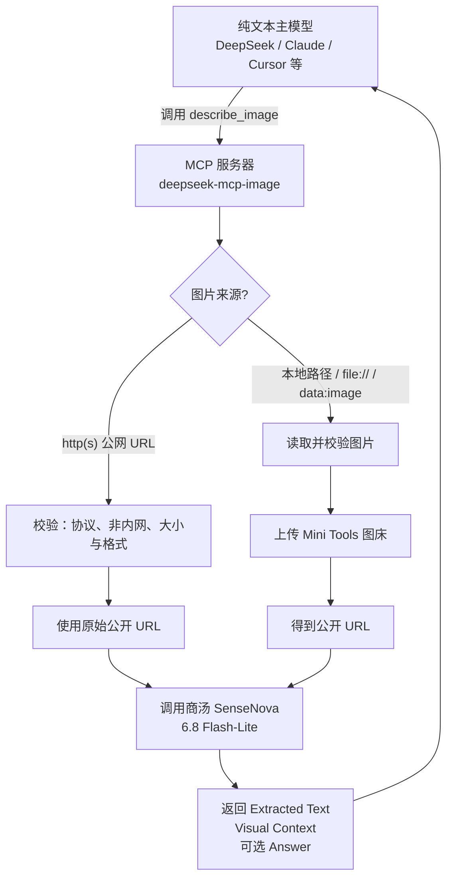
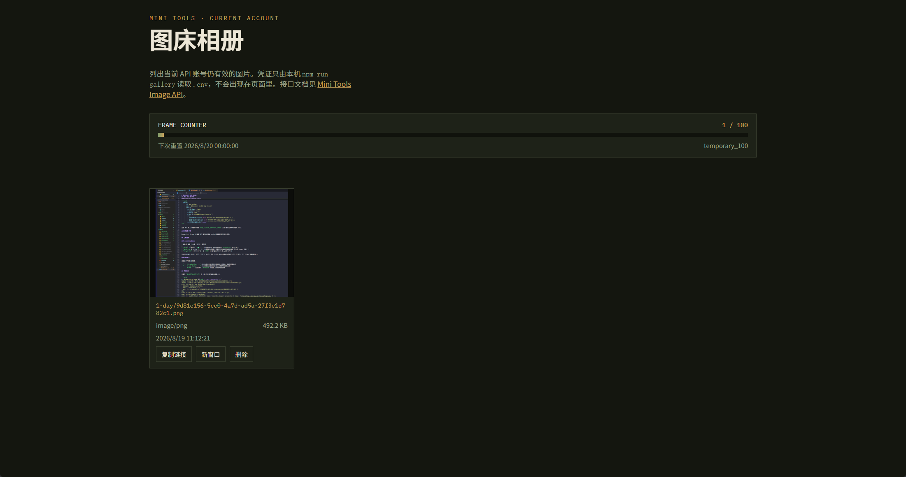

# deepseek-mcp-image

中文 | [English](README.en.md)

## 致谢

本地图片的公网分发使用了 [Mini Tools Image API](https://mini-tools.uk/image-api?lang=zh-CN)。
感谢开源作者 [knsjd25](https://github.com/knsjd25) 提供的 [mini-tools.uk](https://github.com/knsjd25/mini-tools.uk) 图床服务。

给 **DeepSeek 等纯文本模型** 用的识图 MCP 服务器：让不支持图片输入的 LLM 也能看图。

主模型调用 `describe_image` 工具并传入**本地图片路径**或 **http(s) URL**。
公网 URL 校验后直接交给商汤；本地路径会先上传到
[Mini Tools 图床](https://mini-tools.uk/image-api?lang=zh-CN)，再用返回的公开链接调用
**SenseNova 6.8 Flash-Lite**（`sensenova-6.8-flash-lite`）识别，返回文字描述。

## 工作原理

商汤只接受公网可访问的图片 URL。因此 MCP 会按来源分流：已经是公网地址的直接转发；本地图片则先上传图床，再把公开链接交给商汤。



## 环境要求

- Node.js ≥ 18
- 商汤开放平台 API Key（见下方 [申请商汤 API Key](#申请商汤-api-key)）
- 若要识别**本地图片**，还需 Mini Tools 图床的用户 ID 和 API Key（见 [申请图床账号和 API Key](#申请图床账号和-api-key)）

## 安装

推荐用 npm / npx，无需 clone：

```bash
npm install -g deepseek-mcp-image
```

或每次由 MCP 客户端自动拉取：`npx -y deepseek-mcp-image`。

开发者仍可从源码安装：

```bash
git clone https://github.com/Chuyuxuan0v0/deepseek-mcp-image.git
cd deepseek-mcp-image
npm install
```

## 申请商汤 API Key

识图调用走 [SenseNova 开放平台](https://platform.sensenova.cn/)。官方接入说明见 [注册账号与获取 API Key](https://github.com/OpenSenseNova/SenseNova6.7/blob/main/API_CN.md#1-注册账号与获取-api-key)。

1. 打开 [控制台](https://platform.sensenova.cn/console) 或 [登录页](https://platform.sensenova.cn/login)，完成注册（常用手机号 + 短信验证码）与实名认证。免费 token 套餐见 [Token Plan](https://platform.sensenova.cn/token-plan)。
2. 进入控制台左侧：**管理中心 → API-Key 管理 → 创建 API-Key**。
3. 创建成功后**立刻复制**完整 Key（一般以 `sk-` 开头）。它只在创建时显示一次；泄漏了就在同一页删除或禁用，再新建一把。
4. 本项目默认 API 地址是 `https://token.sensenova.cn/v1`，模型为 `sensenova-6.8-flash-lite`。把 Key 写进本机 `.env` 的 `SENSENOVA_API_KEY`，不要提交仓库。

## 申请图床账号和 API Key

本地图片必须先变成公网 URL，本项目使用 [Mini Tools Image API](https://mini-tools.uk/image-api?lang=zh-CN)。网页可以匿名上传，但 MCP 走的是服务端 API，需要管理员分配的账号。

1. 打开 [图片上传 API 文档](https://mini-tools.uk/image-api?lang=zh-CN)，按文档说明申请。申请方式与长期存储相同：**发邮件给管理员**。
2. 联系邮箱见官方仓库与文档：[admin@mini-tools.uk](mailto:admin@mini-tools.uk)（也可从 [联系页面](https://mini-tools.uk/contact?lang=zh-CN) 选择对应邮箱）。说明用途即可，例如「用于开源 MCP 识图，把本地图片上传成公开链接」。
3. 管理员核验申请邮箱后才会启用凭证，并回信给你两样东西：
   - **用户 ID**（请求头 `X-API-User-ID`）
   - **API Key**（请求头 `Authorization: Bearer …`，一般以 `mtu_live_` 开头）
4. 两样都要，缺一不可。只把它们写进本机 `.env`，不要写进代码、不要提交 Git、不要再通过邮件把 Key 发回去。

拿到凭证后，复制 `.env.example` 为 `.env`：

```env
SENSENOVA_API_KEY=sk-你的商汤key
X-API-User-ID=管理员分配的用户ID
Authorization=Bearer mtu_live_你的图床key
```

也可用 `MINI_TOOLS_USER_ID` / `MINI_TOOLS_API_KEY` 这一对变量名。

## 配置环境变量

| 变量 | 必填 | 默认 | 说明 |
|---|---|---|---|
| `SENSENOVA_API_KEY` | ✅ | — | 商汤 API Key |
| `SENSENOVA_BASE_URL` | — | `https://token.sensenova.cn/v1` | API 基础地址 |
| `MINI_TOOLS_USER_ID` | 本地路径时 ✅ | — | Mini Tools 图床用户 ID（也可用 `X-API-User-ID`） |
| `MINI_TOOLS_API_KEY` | 本地路径时 ✅ | — | Mini Tools 图床 API Key（也可用 `Authorization=Bearer …`） |
| `MINI_TOOLS_DURATION` | — | `1-day` | 图床保留期：`1-day` / `7-day` / `30-day` / `permanent` |
| `MAX_IMAGE_BYTES` | — | `20971520`（20MB） | 远程 URL 单张大小上限；图床上传另有 5MB 限制 |

也可复制 `.env.example` 为当前工作目录的 `.env`（已被 git 忽略）。服务器会先读工作目录的 `.env`，再读安装目录里的 `.env`；**MCP 客户端传入的 `env` 优先**。用 npx 时请把密钥写在客户端配置里，不要依赖仓库里的 `.env`。

图床凭证**仅供个人使用**，不要写进代码、不要提交仓库、不要公开。

PowerShell（Windows）示例：

```powershell
$env:SENSENOVA_API_KEY = "sk-你的key"
$env:MINI_TOOLS_USER_ID = "你的图床用户ID"
$env:MINI_TOOLS_API_KEY = "你的图床API Key"
```

## 运行测试

```bash
npm test
```

## 查看当前账号有多少图片

图床 API 不允许浏览器从本地 HTML 直接跨域调用，所以仓库提供了本机相册页：由 `gallery-server.mjs` 读取 `.env`，再去拉 [用量](https://mini-tools.uk/image-api?lang=zh-CN) 和仍有效的图片列表。

```bash
npx deepseek-mcp-image-gallery
```

或在源码目录：`npm run gallery`。

浏览器打开 [http://127.0.0.1:3780](http://127.0.0.1:3780)（不要双击 `gallery.html`）。效果如下：



页面上可以：

- 看顶部 **FRAME COUNTER**：已用 / 总额度（例如 `10 / 100`），以及下次重置时间
- 浏览当前账号**仍有效**的图片缩略图、大小、上传时间
- **复制链接**、**新窗口**打开公开 URL
- **删除**某张图（删除**不会**返还每日额度或永久额度）

按 `Ctrl+C` 结束本机服务。改端口可用环境变量 `GALLERY_PORT`。

## 接入 MCP 客户端

标准 stdio MCP 服务器。推荐用 npx，不必写本机路径：

```json
{
  "mcpServers": {
    "deepseek-mcp-image": {
      "command": "npx",
      "args": ["-y", "deepseek-mcp-image"],
      "env": {
        "SENSENOVA_API_KEY": "sk-你的key",
        "MINI_TOOLS_USER_ID": "你的图床用户ID",
        "MINI_TOOLS_API_KEY": "你的图床API Key"
      }
    }
  }
}
```

已全局安装时，也可 `"command": "deepseek-mcp-image"`（Windows 上 npm 会生成 `.cmd`）。从源码调试则用：`node <本仓库路径>/src/index.js`。

Claude Desktop 把上面这段写入 `claude_desktop_config.json`；Cursor 写入 MCP 设置即可。

### DeepSeek Harness（dsh）

在 profile 补丁层（如 `~/.dsh/profiles/web/cordis.patch.yml`）追加一行：

```yaml
- insert:
    - id: mcp-vision
      name: '@deepseek-ai/dsh-mcp-client'
      config:
        serverName: vision
        transport: stdio
        command: npx
        args: ['-y', 'deepseek-mcp-image']
        env:
          SENSENOVA_API_KEY: !!js process.env.SENSENOVA_API_KEY ?? ''
          MINI_TOOLS_USER_ID: !!js process.env.MINI_TOOLS_USER_ID ?? ''
          MINI_TOOLS_API_KEY: !!js process.env.MINI_TOOLS_API_KEY ?? ''
        failOnStartupError: false
```

重启 dsh 后，主模型即可看到 `mcp__vision__describe_image` 工具（图片支持本地路径或 URL）。

### 其他客户端

Reasonix / Cursor / 通用 MCP 客户端按各自 stdio 服务器配置方式接入即可。

## 工具说明

### describe_image

| 参数 | 类型 | 必填 | 默认 | 说明 |
|---|---|---|---|---|
| `image` | string | ✅ | — | 本地图片路径、`file://`、`data:image`，或模型可访问的 `http(s)://` 图片 URL |
| `question` | string | — | — | 要问图片的问题。省略时只做文字提取与视觉描述，不生成 Answer 分区。 |
| `max_tokens` | integer | — | `2000` | 最大生成 token 数，上限 8192 |

支持的图片格式：PNG / JPEG / GIF / WebP / BMP / SVG。本地上传图床时仅支持 JPEG / PNG / GIF / WebP（图床限制）。

### 输出格式

模型按以下分区返回结果：

- `--- Extracted Text ---`：图片中所有文字/符号的逐字转录（代码块、表格等保留格式）
- `--- Visual Context ---`：非文字视觉内容的描述（纯文字截图可能省略此区）
- `--- Answer ---`：仅当传入 `question` 时出现，为对该问题的回答

## 手动验收

设置好 `SENSENOVA_API_KEY` 后，用 SDK 客户端脚本调用一次：

```bash
cd deepseek-mcp-image && node --input-type=module -e "
import { Client } from '@modelcontextprotocol/sdk/client/index.js';
import { StdioClientTransport } from '@modelcontextprotocol/sdk/client/stdio.js';
const transport = new StdioClientTransport({
  command: process.execPath,
  args: ['src/index.js'],
  env: { ...process.env, SENSENOVA_API_KEY: process.env.SENSENOVA_API_KEY },
});
const client = new Client({ name: 'manual', version: '0.0.1' });
await client.connect(transport);
const r = await client.callTool({ name: 'describe_image', arguments: { image: 'https://www.sensenova.cn/images/logo.png' } });
console.log(JSON.stringify(r, null, 2));
await client.close();
"
```

预期输出：`isError` 为 `false`，`content[0].text` 为图片的文字描述。

## 限制

- 商汤接口要求图片为模型可访问的 `http(s)` URL。公网 URL 直接转发；本地路径需配置 Mini Tools 图床凭证后自动上传。
- 远程图片单张上限默认 20MB（`MAX_IMAGE_BYTES` 可调）；图床单张上限 5MB。
- 不缓存 API 结果；每次调用都会消耗商汤 API 额度，本地图片还会消耗图床额度。
- `finish_reason = content_filter` 时返回合规拦截提示（可能命中商汤内容审核）。

## License

[MIT](LICENSE)
